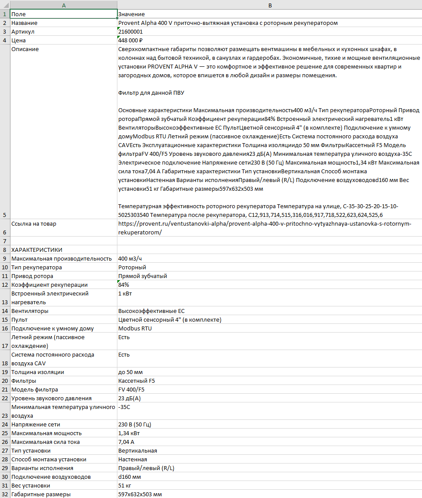
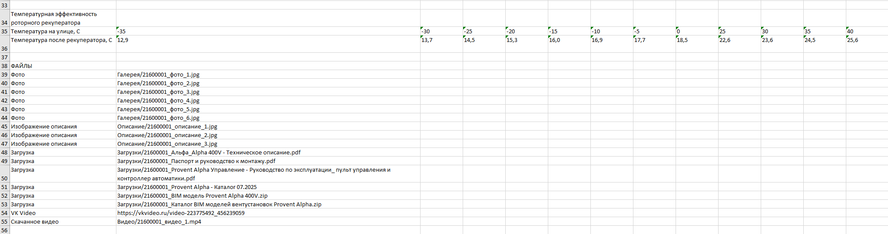
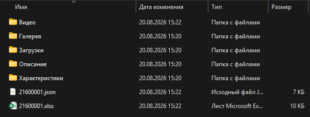
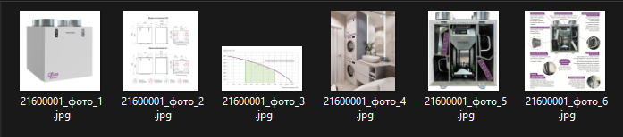

# Provent Parser

## О проекте

Provent Parser — автоматизированный веб-парсер для сбора данных из каталога интернет-магазина.

Проект предназначен для автоматизации переноса и обработки большого количества товарной информации без ручного копирования данных.

Парсер собирает данные с карточек товаров, обрабатывает полученную информацию и сохраняет её в структурированном виде.

---

## Возможности

Парсер автоматически собирает:

- Название товара
- Артикул
- Цену
- Описание
- Характеристики
- Фотографии
- Видео
- Дополнительные файлы и материалы

---

## Обработка данных

Парсер умеет работать с разными форматами информации:

- Текстовые описания
- Списки
- Таблицы характеристик
- Различные структуры HTML-страниц

Дополнительно обрабатываются:

- Изображения из описаний товаров
- Скачиваемые файлы из карточек товаров
- Видео и медиа-материалы

---

## Результат работы

После обработки данные сохраняются в структурированном виде:

- Excel-файлы с информацией о товарах
- JSON-файлы
- Папки с фотографиями
- Папки с видео
- Папки с дополнительными файлами

---

## Скриншоты

### Экспорт данных в Excel

### Структура результата

### Загруженная галерея товаров

---

## Технологии

- Python
- Web scraping
- Requests
- BeautifulSoup
- OpenPyXL
- yt-dlp
- Обработка и структурирование данных
- Работа с HTML-страницами
- JSON
- Excel
- Автоматизация обработки файлов и данных

---

## Статус проекта

✅ Рабочая версия

Проект может расширяться под другие каталоги и различные структуры данных.
